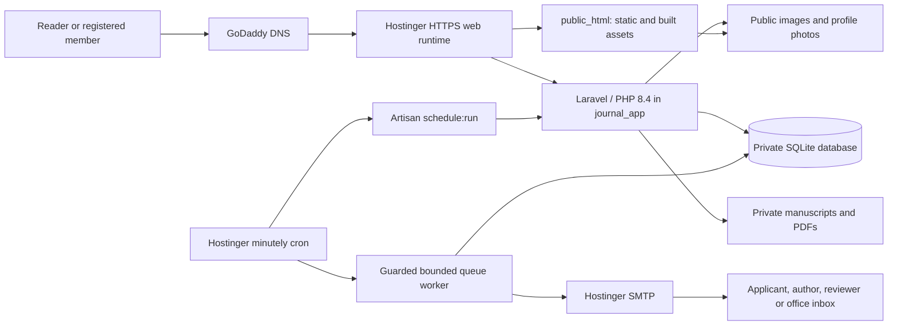
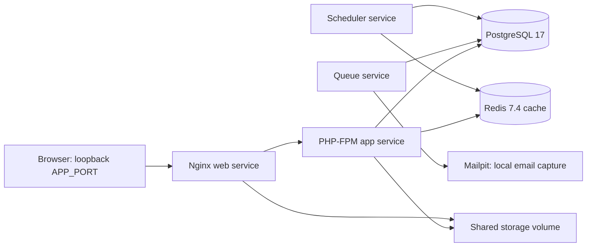
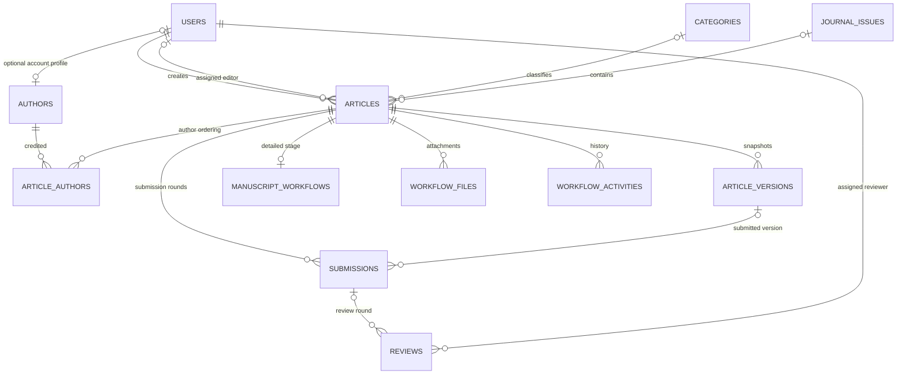
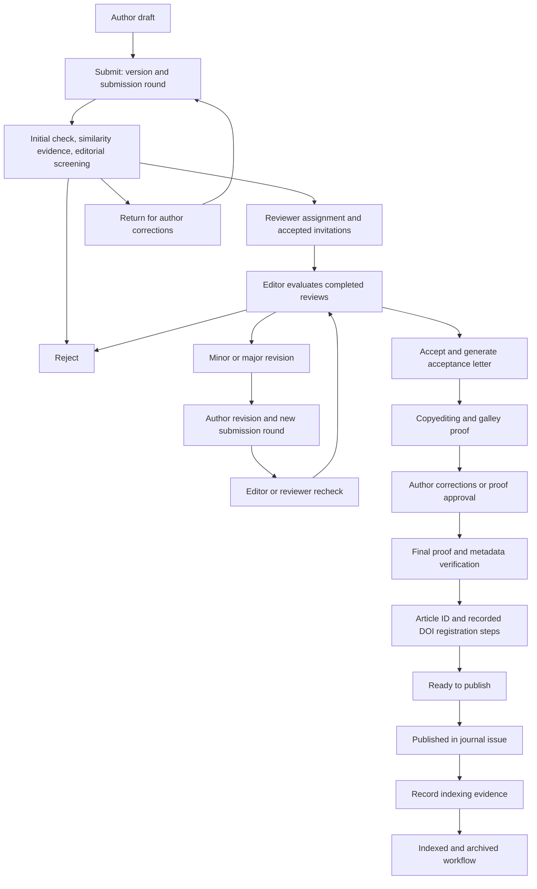
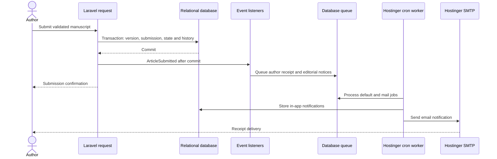

# Singapore Journal of Cardiology — Architecture

Repository snapshot: **10 October 2026**. Live website: [sjcjournal.com](https://sjcjournal.com). Dependency versions and environment comparisons are documented in [Tech Stack](TECH_STACK.md).

## 1. System overview

The journal is a **modular Laravel monolith**. One application serves the public publication, account applications, author/contributor workspace, editor and reviewer portals, administration and a versioned JSON API. Blade renders HTML on the server; JavaScript adds navigation, reading tools, PDF viewing and optional analytics.

The relational database is the system of record. Laravel services control manuscript transitions and authorization; events and queued notifications handle communication. Files live in separate private/public storage areas, with their metadata and relationships in the database.

The current production topology is Hostinger shared hosting with SQLite. The repository also supplies a Docker topology with PostgreSQL and Redis. These environments run the same application with different infrastructure configuration.

## 2. Deployment topology

### Current production: Hostinger



The app directory is outside the public document root:

```text
domain-root/
├── journal_app/
│   ├── app/, bootstrap/, config/, resources/, routes/, vendor/
│   ├── .env                         private runtime configuration
│   ├── database/                    migrations and database resources
│   └── storage/
│       ├── app/private/             manuscripts and controlled documents
│       ├── app/public/              publicly served images
│       ├── framework/               runtime cache and compiled views
│       └── logs/
└── public_html/
    ├── index.php                    Laravel entry point
    ├── build/                       Vite output and manifest
    ├── assets/                      journal assets
    └── storage -> ../journal_app/storage/app/public
```

The SQLite database path is configured privately through `DB_DATABASE` and remains outside the webroot. The private environment also determines cache and session drivers. Their repository defaults are database stores; the Docker environment explicitly selects Redis cache and database sessions. Redis is not a required dependency of the current shared-host deployment.

Two cron jobs run every minute: `artisan schedule:run` and [scripts/hostinger-mail-worker.php](../scripts/hostinger-mail-worker.php), using Hostinger's PHP 8.4 executable. The worker checks the private pause marker and production SMTP configuration, then processes `default,mail` queues with `--stop-when-empty`, `--max-time=50` and `--tries=3`. There is no requirement for a permanently running Supervisor worker on shared hosting.

### Docker development/reference deployment



[docker-compose.yml](../docker-compose.yml) defines `app`, `web`, `queue`, `scheduler`, `postgres`, `redis`, `mailpit` and an isolated `test` service. PostgreSQL, Redis and storage use persistent volumes. The reference queue is database-backed. The web port defaults to `127.0.0.1:8080`; `APP_PORT` can change it. Container/VPS deployment instructions in [DEPLOYMENT.md](DEPLOYMENT.md) describe this reference topology, rather than the current Hostinger installation.

## 3. Application boundaries

| Boundary | Main source | Responsibility |
| --- | --- | --- |
| Public publication | [routes/public.php](../routes/public.php), `app/Http/Controllers/Public`, `resources/views/public` | Published articles, journal issues, archive, search, people, policies, contact and reader pages |
| Identity and account applications | [routes/auth.php](../routes/auth.php), `app/Http/Controllers/Auth`, [AccountApplicationNotifications](../app/Services/AccountApplicationNotifications.php) | Registration, verification, password recovery, login and approval communication |
| Role portals | [routes/portal.php](../routes/portal.php), role-specific controllers/views | Author/contributor, editor, reviewer and administrative workspaces |
| Authorization | `app/Http/Middleware`, `app/Policies`, [RoleService](../app/Services/RoleService.php), [AppServiceProvider](../app/Providers/AppServiceProvider.php) | Active account checks, role/permission gates and record-level access |
| Editorial domain | [ManuscriptWorkflowService](../app/Services/ManuscriptWorkflowService.php), [ArticleWorkflowService](../app/Services/ArticleWorkflowService.php), [config/workflow.php](../config/workflow.php) | Allowed actions, state transitions, versioning, reviews, deadlines and publication requirements |
| Persistence | `app/Models`, `database/migrations` | Relationships, query scopes, schema and durable records |
| Side effects | `app/Events`, `app/Listeners`, `app/Notifications`, [EventServiceProvider](../app/Providers/EventServiceProvider.php) | Explicit event/listener wiring, in-app notices and queued email |
| Storage and content | [UploadManager](../app/Services/UploadManager.php), [MediaStorageService](../app/Services/MediaStorageService.php), [ImageUploadOptimizer](../app/Services/ImageUploadOptimizer.php), [RichTextSanitizer](../app/Services/RichTextSanitizer.php) | File validation, replacement, visibility, image processing and allowed rich HTML |
| Search and SEO | [DatabaseArticleSearch](../app/Services/DatabaseArticleSearch.php), [PublicSeo](../app/Services/PublicSeo.php), public Blade layout | Published-only search, metadata, canonical URLs and structured data |
| API | [routes/api.php](../routes/api.php), `app/Http/Controllers/Api` | Versioned JSON resources and Sanctum-protected manuscript operations |

Requests pass through middleware, Form Request validation and authorization before reaching domain services. Policies and workflow services enforce record ownership and allowed actions; hiding a button in Blade does not grant or revoke permission.

## 4. Core data model

The diagram shows the main editorial relationships, not every table or column. Migration files are the authoritative schema.



`Article` holds the public identifier/slug, title, scholarly metadata, publication status, timestamps and relationships. `ArticleVersion` preserves submitted snapshots; `Submission` records each round; `Review` records invitations, deadlines, recommendations and separate author/confidential comments. `ManuscriptWorkflow` holds the detailed stage and structured workflow evidence.

`WorkflowFile` stores attachment purpose, round, checksum and storage path. `WorkflowActivity` records the actor, action, prior/new stage, context and author visibility. General `AuditLog` records administrative and authentication activity.

Other tables support role/permission pivots, article tags, comments, article views, search logs, settings, contact submissions, newsletter subscribers, Laravel notifications, queue jobs and failed jobs. `EditorialMember` is a separate curated board record; public pages can also display eligible registered staff profiles. Imported author records can exist without a login account.

## 5. Account lifecycle and authorization

Registration routes select the requested role on the server: Author, Contributor, Editor, Reviewer or Admin. An application starts with `status=pending`, `is_active=false` and no assigned permissions. The application queues a verification email, a pending-status receipt and an alert to the configured approvers/office.

Email verification and Super Admin approval are independent conditions and can occur in either order:

```text
Portal access = valid authentication
             + active approved account
             + verified email
             + permitted role/action
```

Approval assigns the requested role and activates the account. Rejection leaves it inactive and removes roles. There is no public Super Admin registration route; bootstrap/management actions establish that role separately. Optional Google sign-in verifies provider identity but retains the journal's approval requirement.

| Role | Main boundary |
| --- | --- |
| Super Admin | Account approval, role/permission management, settings and administrative oversight; server-side gate override |
| Admin | Publication operations, workflow administration, media, contacts and permitted reports |
| Editor | Editorial checks, assigned workflow work, reviewer coordination and decisions under the applicable policies |
| Reviewer | Assigned invitations/manuscripts and reviewer reports; no manuscript authorship or unrestricted publication access |
| Author / Contributor | Own manuscripts, drafts, revisions, proofs and profile; contributors use the author workspace |
| User | Legacy limited reader role; not a public staff-application route |

Browser portals use Laravel sessions, CSRF protection and `auth`/`active`/`verified`/role middleware. API token issuance requires an active, verified account; abilities narrow access further without replacing role checks or policies. See [API](API.md) for endpoints and token usage.

Uploaded member photos are public only for eligible active, verified accounts with a photo. The public directory and `/people/{id}` expose the selected profile fields and published work, excluding email, phone and private reviewer details. Photos synchronize to linked author portraits and render in public bylines, eligible editorial profiles and approved comments. See [Profile photos](PROFILE_PHOTOS_20261009.md).

## 6. Editorial and publication lifecycle

The implementation separates three state layers:

| Layer | Purpose | Source |
| --- | --- | --- |
| Article status | Coarse publication/access state, including draft, submitted, under review, revision required, approved, production, scheduled, published and terminal states | [ArticleStatus](../app/Enums/ArticleStatus.php) |
| Submission/review status | Per-round submission decisions and individual reviewer progress | [SubmissionStatus](../app/Enums/SubmissionStatus.php), [ReviewStatus](../app/Enums/ReviewStatus.php) |
| Manuscript workflow stage | Detailed editorial checks, review, production, DOI and indexing evidence | [Workflow configuration](../config/workflow.php), [ManuscriptWorkflowService](../app/Services/ManuscriptWorkflowService.php) |

The following diagram groups the principal detailed stages; it is not an exhaustive transition matrix:



Domain services validate the actor, current stage, required input and supporting files inside database transactions. They lock the relevant records where implemented, preserve submitted versions and record activity. Reviewers accept/decline invitations and submit a recommendation with author-facing comments and separate confidential notes. Author responses and resubmissions stay linked to their submission round.

Detailed workflow publication requires recorded acceptance, author proof approval, verified metadata, an article number, a DOI marked ready for publication, an issue and a final PDF. DOI preparation is bound to [ManualDoiProvider](../app/Services/ManualDoiProvider.php); similarity and indexing steps record editorial evidence rather than calling an external checking/indexing service.

The coarse `ArticleWorkflowService` also supports controlled status transitions and scheduled publication. Existing imported records may have no detailed workflow; an administrator can explicitly adopt a compatible record into it. A detailed workflow archive stage and the coarse article publication status are separate values; public visibility is determined by the article's published scope.

## 7. Notification flow



Submission events alert the author, assigned editor, active administrative recipients and configured office as applicable. Account events notify the applicant and approvers; reviewer events notify assigned reviewers and relevant stakeholders; workflow actions notify the applicable author/editor/administrators. Contact submissions generate sender receipts and office alerts. Recipient selection and office-address deduplication live in the notification services/listeners.

Events such as `ArticleSubmitted`, `ArticleStatusChanged`, `ReviewAssigned`, `ReviewCompleted` and `ContactSubmissionReceived` dispatch after transaction commit. Core workflow notifications use the `mail` queue with `afterCommit()`. In-app and SMTP delivery happen asynchronously; a submission confirmation does not assert that an email has reached an inbox. Queue processing is retryable, so delivery is not an exactly-once guarantee.

Messages include relevant manuscript context and authenticated links. Author messages omit confidential reviewer notes. The current sender is `notifications@sjcjournal.com`; SMTP secrets remain in private configuration. `admin@sjcjournal.com` is an alias to that mailbox. The deliberately held older contact-message queue is not processed by the regular `default,mail` worker. See [Mail setup](MAIL_SETUP.md) and [Workflow verification](WORKFLOW_VERIFICATION_20261008.md).

## 8. Storage, rendering and privacy

| Content | Storage/access rule |
| --- | --- |
| Manuscripts, cover letters, reviewer files, proofs | Private local disk; authorized controller routes enforce role/record access |
| Published reading PDF | Private bytes served by the public article PDF route after publication/download checks; PDF.js renders it inside the website |
| Profile photos, covers and public images | Public disk exposed through the public storage mapping |
| Generated acceptance letters | Dompdf output from workflow evidence, returned through an authorized download action |
| Rich article HTML | Sanitizer-controlled HTML; ordinary Blade fields are escaped |

Image uploads are validated and optimized with GD; optional image binaries are available in Docker. Profile photo requests impose a 5 MB limit. Other uploads have their own request rules and publication limits. `UploadManager` coordinates file replacement and shared references; `MediaStorageService` records MIME, checksum, visibility and uploader metadata. Filesystem writes are not part of a relational database transaction, so file replacement includes explicit cleanup handling.

Vite builds `app.css`, `app.js` and imported reader assets into `public/build`. The public Blade layout also reads `resources/css/journal-pages.css` directly into an inline style block; analytics JavaScript is included through its Blade component. Deployments must therefore preserve both compiled assets and the relevant source templates/styles/scripts. The PDF worker uses a `.js` bundle for shared-host MIME compatibility.

## 9. Search, SEO and analytics

`ArticleSearch` is bound to `DatabaseArticleSearch`. Searches return published records, paginate results and eager-load display relationships. PostgreSQL uses full-text SQL with related-field matching; SQLite uses the implemented `LIKE` fallback. No external search cluster is required.

Public pages render titles/descriptions, canonical and social metadata, JSON-LD, scholarly citations, sitemap and robots rules. Private account/manuscript routes receive noindex handling. Keyword fields accept editorially verified terms; the existing [keyword worksheet](SEO_KEYWORDS.csv) is a suggestion list, not original author-supplied scientific keywords.

First-party article-view/search records support internal reporting. They are separate from external GA4 and have their own fields, including search text and configured visitor/session identifiers.

GA4 `G-VPMDF48T9K` loads only after visitor consent, in production on the configured host, for anonymous visitors on eligible public reader pages. Account, editorial, submission, contact and search pages are excluded. Page URLs omit query strings; referrers are reduced to origin; custom events cover page views and eligible public PDF downloads. Clarity is disabled. Browser-level GA4 Realtime receipt remains unconfirmed in the deployment report. See [Analytics and SEO](ANALYTICS_SEO_20261009.md) for exact boundaries and validation evidence.

## 10. Operations and delivery

[routes/console.php](../routes/console.php) schedules due publication every minute, workflow reminders hourly, and failed-job/token pruning daily. Scheduled commands run in-process through `Artisan::call()` to accommodate shared hosting with `proc_open` disabled. Overlap/one-server locks are used for publication and reminders.

Hostinger deployment preserves the private `.env`, SQLite database, durable storage, storage mapping and deployment-specific public/bootstrap paths. Existing release tooling uses baseline checks, changed-file backups and a temporary private CLI launcher through cron; it restores the regular worker after applying a release. A GitHub push records source changes and does not itself constitute a Hostinger deployment.

Builds install dependencies from lockfiles and publish Vite output when asset inputs change. Runtime keys, passwords, database files, private evidence and user uploads are not release-source artifacts. Migrations apply schema changes; configuration/view caches must reflect the deployed files.

Backups for the current installation must cover a consistent SQLite database snapshot, private/public media and protected runtime configuration. [BACKUP_AND_RESTORE.md](BACKUP_AND_RESTORE.md) describes the PostgreSQL/VPS reference procedure; its `pg_dump` commands do not apply to SQLite. Rollback must account for database compatibility and storage as well as source files.

The application exposes `/up` for an application health response, Laravel logs for failures, audit/workflow activity for business history and failed-job records for queue failures. A health response alone does not confirm successful email delivery or analytics receipt.

## 11. Security and verification

Security boundaries include CSRF/session controls, password hashing, verified/approved account checks, permission and policy enforcement, upload validation, rich-text sanitization, rate limits and security response headers. Local role bypasses are restricted to the local environment and loopback conditions; they must remain disabled on the live site. API responses and public pages avoid exposing production exception traces.

The [CI workflow](../.github/workflows/ci.yml) runs Composer audit, dedicated PostgreSQL migrations/tests, Pint, the Vite build and a production Docker build. The Docker `test` service uses isolated in-memory SQLite. JavaScript analytics tests run separately with Node and are not currently included in CI. Historical feature reports document their own tested release scope; they are not a substitute for checking a new release.

For changes to business flows, verify the affected role/action, unauthorized access, saved version/state, notification recipients and confidentiality. For deployment changes, verify the public/private storage mapping, scheduler and queue configuration, application health and rollback behavior. For documentation-only changes, validate source references, version claims, Markdown links and diagram structure without changing runtime state.

## 12. Extension points and current limits

Search and DOI have explicit contracts; Flysystem supports optional S3 storage; mail transports are configurable. The current system remains a single application rather than a set of independently deployed services.

SQLite and a bounded cron worker fit the current shared-host topology. A move to multiple application instances would require a shared relational database, shared file storage, a cache store suitable for distributed scheduler locks and managed queue workers. The PostgreSQL/Redis container topology supplies a reference for that move, but is not evidence that such a migration has occurred.

Related documents: [Tech Stack](TECH_STACK.md), [README](../README.md), [API](API.md), [Mail setup](MAIL_SETUP.md), [Workflow verification](WORKFLOW_VERIFICATION_20261008.md), [Public profile photos](PROFILE_PHOTOS_20261009.md), [Analytics and SEO](ANALYTICS_SEO_20261009.md), [Security policy](../SECURITY.md).
